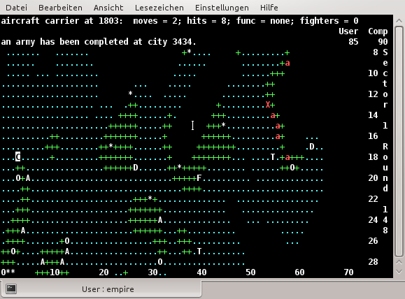

# Imperial-rs

A rusty rewrite of [Empire], based on the [VMS port] that was rewritten in C.

[Empire]: https://en.wikipedia.org/wiki/Classic_Empire
[VMS port]: http://www.catb.org/esr/vms-empire/

The classic version of Empire looks a little like this:

The plan is to slowly move from the existing C code base to a fully rust code base. Eventually, I would like the core of the game to be `#![no_std]`, so this could be used by embedded platforms.

## License

The original game source, vendored in this repository, is GPLv2. As I expect to transliterate the source, rather than rewrite it clean-room style, it is probably best to keep the original license.

I may consider changing this if I perform major refactoring, however I likely will not care enough to figure out what needs to be done to do this. Please open an issue if you would like to discuss.

See [LICENSE](./LICENSE) or [COPYING](./vms-empire/COPYING) for more information.